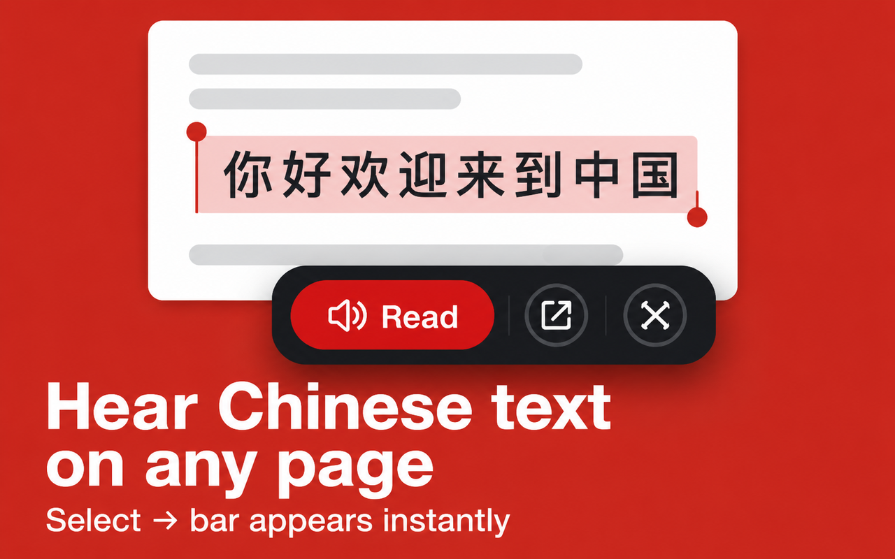

# Chinese Text to Speech



Chrome extension (Manifest V3), live on the
[Chrome Web Store](https://chromewebstore.google.com/detail/kfoonobmdlloonajhikajicnohljhdnk)
with real installs. Select Chinese text anywhere on the web, right-click
"🔊 Listen", and it opens the TTS web app with your selection pre-filled.

## Why this extension is small

This extension is a thin launcher, not a self-contained tool.
`background.js` is about 55 lines: a toolbar-click handler, a context
menu, and analytics. It does not synthesize speech itself. An earlier
version did (see the version history below), and that approach meant
duplicating TTS provider integration, audio playback, and error handling
inside a service worker, which can't reliably hold state or play audio on
its own in MV3.

Speech synthesis itself, meaning multi-provider fallback (iFLYTEK primary,
Tencent Cloud fallback), audio caching, and the adjustable-speed player
UI, lives in the shared backend and frontend at
[`uranbekanarbaev.dev`](https://uranbekanarbaev.dev), the `ctts` module
inside the [`hsk-tutor`](https://github.com/uranbekanarbaev/hsk-tutor)
repo. See
[`app/services/tts_resilient.py`](https://github.com/uranbekanarbaev/hsk-tutor/blob/main/backend/app/services/tts_resilient.py)
there for the resilience pattern. This extension is the distribution
channel; that repo is where the backend work happens. Splitting it this
way fixed the state/audio problem above, and wasn't the original design.

## What it does

1. Click the toolbar icon → opens the TTS web app.
2. Select Chinese text on any page → right-click → "🔊 Listen" → opens
   the web app with that text pre-filled and ready to play.
3. Install/uninstall funnel tracking (Amplitude) carries a stable
   `device_id` from the extension into the web app's URL, so an
   install-to-first-listen funnel can be measured across the extension and
   website, not just within the extension.

## Code worth reading

[`extension/lib/tts-url.js`](extension/lib/tts-url.js) handles URL
construction and Chinese detection, pulled out of `background.js` so it's
unit-tested rather than only reachable by right-clicking in a real
browser. It covers the edge case that actually matters here: selected
text containing `&`, `%`, or `?` has to survive being round-tripped
through a URL query param without corrupting the original selection.

The uninstall URL now carries `amp_device_id`, matching the sibling
[`chinese-to-pinyin`](https://github.com/uranbekanarbaev/chinese-to-pinyin)
extension's funnel-tracking pattern. The original only set it on the
welcome URL, so uninstalls couldn't be tied back to the same Amplitude
user.

## Testing

```bash
npm install
npm test
```

7 tests against the extracted URL/detection logic, the actual business
logic this extension has. CI runs the suite on every push, see
[`.github/workflows/ci.yml`](.github/workflows/ci.yml).

## Loading it locally

```
chrome://extensions → Developer mode → Load unpacked → select extension/
```

## Stack

Manifest V3 · service worker (no content script, since the extension
needs no page access, hence no `host_permissions` beyond Amplitude's
endpoint) · Amplitude · Jest · GitHub Actions
